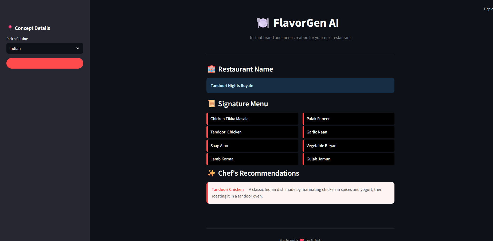

# 🍴 FlavorGen AI
**Instant Brand and Menu Creation for Modern Restaurateurs.**

FlavorGen AI is an intelligent branding tool designed for food entrepreneurs. By leveraging Large Language Models (LLMs) via LangChain, it instantly generates a cohesive restaurant concept, including a unique name, a signature menu, and professional chef recommendations with detailed descriptions.

---

## 🚀 Features
* **Intelligent Naming:** Generates creative, cuisine-specific restaurant titles.
* **Signature Menu Creation:** Curates a balanced list of 8–10 essential dishes based on the selected cuisine.
* **AI Chef’s Highlights:** Selects top-tier items from the menu and provides appetizing, professional descriptions.
* **Polished UI:** A dark-themed, responsive dashboard built with Streamlit and custom CSS for a premium user experience.

---

## 🛠️ Tech Stack
* **Frontend:** [Streamlit](https://streamlit.io/)
* **LLM Orchestration:** [LangChain](https://www.langchain.com/)
* **Language Model:** Google Gemini / OpenAI 
* **Language:** Python 3.x

---

## 📸 Interface
The image below demonstrates the **FlavorGen AI** workflow, showcasing a generated concept for Indian cuisine:



---

## 💡 How It Works
1.  **Selection:** The user chooses a cuisine type from the sidebar.
2.  **Sequential Chains:**
    * **Chain 1:** Generates a professional restaurant name.
    * **Chain 2:** Generates a comma-separated list of signature menu items.
    * **Chain 3:** Processes the menu list to create "Chef's Recommendations" with sensory descriptions.
3.  **Dynamic Rendering:** The Streamlit UI parses the AI response and displays it using custom HTML/CSS components.

---

## ⚙️ Installation & Usage

1.  **Clone the Repository:**
    ```bash
    git clone [https://github.com/your-username/flavorgen-ai.git](https://github.com/your-username/flavorgen-ai.git)
    cd flavorgen-ai
    ```

2.  **Install Dependencies:**
    ```bash
    pip install -r requirements.txt
    ```

3.  **Set Up Environment Variables:**
    Create a `.env` file and add your API Key:
    ```env
    GOOGLE_API_KEY=your_api_key_here
    ```

4.  **Run the App:**
    ```bash
    streamlit run app.py
    ```

---

## 👨‍💻 Author
Developed by **Nitish** *BTech Information Technology Student & AI Enthusiast*

---
